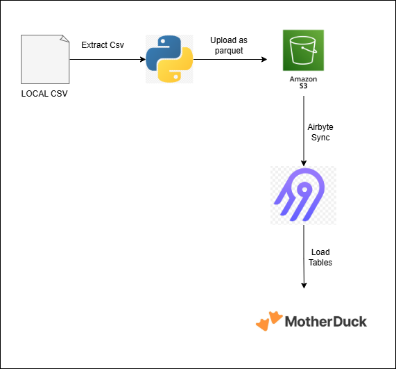

# Project Title

Short description of what this project does.


## Project Overview
The project implements a simple cloud based engineering pipeline that ingests retailios dataset and loads them into a cloud data warehouse for analysis.
The pipeline exctracts data from the csv files using dependencies like pandas awswrangler, uploads them in a data lake(AWS S3) and then it is synchronised into a data warehouse (motherDuck) using airbyte as the integration tool.SQL queries are then used to validate and analyse the data.

## Data Pipeline Architecture



## Technologies Used

| Tool                       | Purpose                          |
|----------------------------|----------------------------------|
| Python                     | Data ingestion and automation    |
| AWS S3                     | Data lake storage                |
| Airbyte                    | Data pipeline / data integration |
| MotherDuck                 | Cloud data warehouse             |
| DuckDB SQL                 | Querying and data analysis       |
| Virtual Environment (venv) | Dependency management            |

Python libraries used:
- boto3
- pandas
- awswrangler
- python-dotenv

---
## 4. Pipeline Implementation

### Step 1 — Data Extraction
The pipeline starts with CSV datasets containing retail information:

- `products.csv`
- `customers.csv`
- `sales.csv`

These files are stored locally before ingestion.

---

### Step 2 — Uploading Data to S3
A Python script is used to upload the datasets to an AWS S3 bucket.  

Key features of the script:

- Reads CSV files using `pandas`
- Converts datasets to **Parquet format**
- Uploads data to an S3 bucket
- Stores data in a **raw data lake layer**

Example snippet from the Python script:

```python
import pandas as pd
import awswrangler as wr

df = pd.read_csv("data/products.csv", encoding="latin1")
wr.s3.to_parquet(
    df=df,
    path="s3://retailio-data-lake-ik/raw/products",
    index=False,
    mode='overwrite',
    dataset=True
)
```

## Step 4 — Data Integration with Airbyte

Airbyte was used to synchronize the data from the AWS S3 data lake into the MotherDuck data warehouse.

Pipeline configuration included:

- **Source:** AWS S3  
- **Destination:** MotherDuck  
- **Sync Mode:** Full refresh  

Airbyte automatically transfers and loads the datasets from the S3 bucket into the warehouse tables.

This integration allows the raw data stored in the data lake to be structured and queried efficiently within the data warehouse.

---

## Step 5 — Data Validation

After synchronization, SQL queries were used to validate the quality and integrity of the data in the warehouse.

The following checks were performed:

- Row count verification
- Null value detection
- Duplicate record detection
- Data freshness checks

Example row count query:

```sql
SELECT COUNT(*)
FROM retailio_database.sales;
```

Example duplicate check:

```sql
SELECT product_id, COUNT(*)
FROM retailio_database.products
GROUP BY product_id
HAVING COUNT(*) > 1;
```

Example null value check:

```sql
SELECT COUNT(*)
FROM retailio_database.customers
WHERE customer_id IS NULL;
```

These checks ensure that the data pipeline transferred the data correctly and that no corrupted or missing records were introduced during the process.

---

## Step 6 — Example Analytics Query

A view was created to generate a summary of daily sales activity.

```sql
CREATE OR REPLACE VIEW sales_summary AS
SELECT
    DATE(order_date) AS order_date,
    COUNT(DISTINCT order_id) AS total_orders,
    SUM(quantity) AS total_quantity,
    SUM(profit) AS total_profit
FROM retailio_database.sales
GROUP BY DATE(order_date)
ORDER BY DATE(order_date);
```

This query provides a daily summary of sales performance by calculating:

- the total number of orders
- the total quantity of products sold
- the total profit generated each day